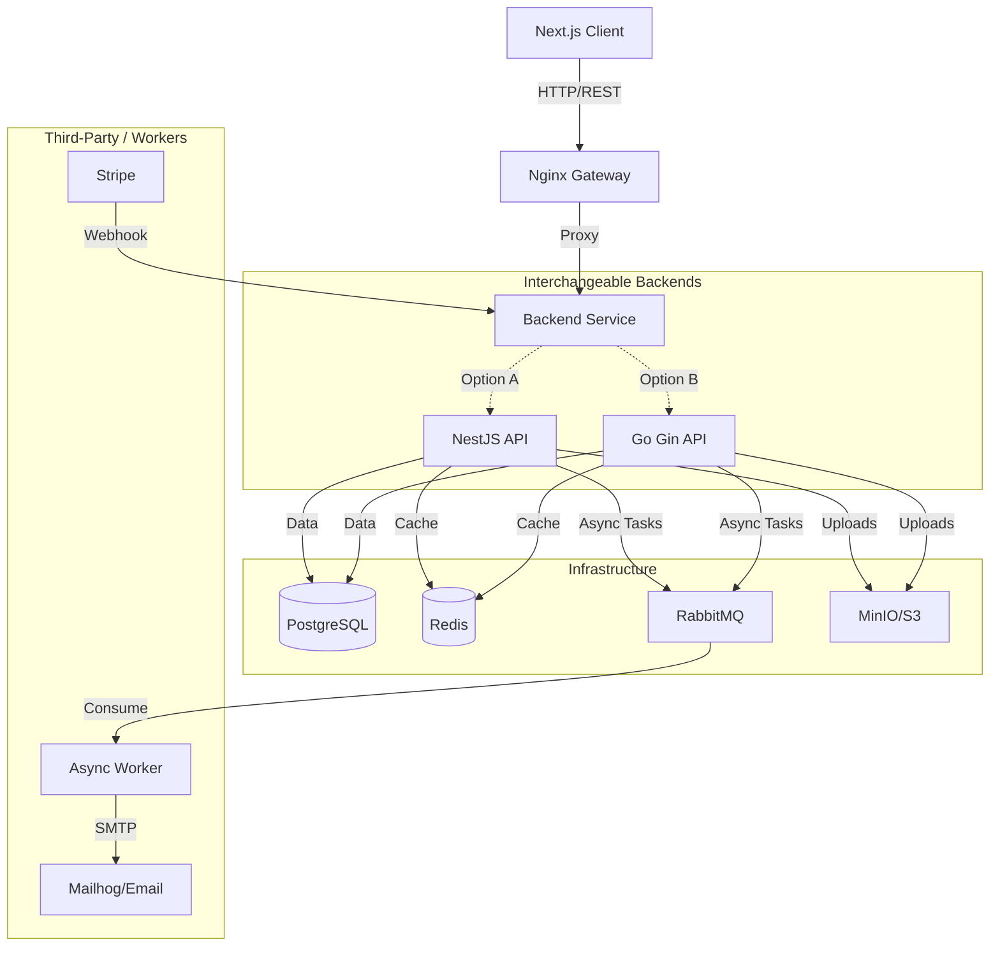

# 🚀 Dev Forum - Dual Engine Fullstack Platform

> A modern, production-ready forum application powered by **Next.js**, supporting interchangeable backends: **NestJS** and **Go (Gin)**.


## 🌟 Key Features

- **Dual-Engine Backend**: Seamlessly switch between **NestJS** (TypeScript) and **Go** (Gin) backends.
- **Microservice-Ready**: Fully containerized with Docker Compose.
- **Async Architecture**: Decoupled background tasks (Email, Notifications) using **RabbitMQ**.
- **Payment Integration**: **Stripe** subscription support with Webhook handling.
- **Email Service**: Integrated **Mailhog** for local email testing and SMTP for production.
- **Modern Frontend**: Next.js 14 (App Router) with Tailwind CSS.
- **Robust Storage**: Object storage support compatible with AWS S3 / MinIO.

## 🏗 System Architecture



## 🛠️ Tech Stack

| Component | Technology |
| --- | --- |
| **Frontend** | Next.js 14, React, Tailwind CSS, TypeScript |
| **Backend A** | NestJS, Prisma, Passport, RxJS |
| **Backend B** | Go (1.21+), Gin, GORM, Gomail |
| **Database** | PostgreSQL 15 |
| **Message Queue** | RabbitMQ |
| **Caching** | Redis |
| **DevOps** | Docker, Docker Compose, Nginx |

## 🚀 Getting Started

### Prerequisites

* Docker & Docker Compose
* Node.js (v18+) & pnpm
* Go (v1.21+) (Optional, for local Go dev)

### Quick Start (The "Dual Mode")

You can choose which backend engine to run using Docker profiles.

**Option A: Run with NestJS Backend**

```bash
docker-compose -f docker-compose.local-prod.yml --profile nest up -d --build

```

**Option B: Run with Go Backend**

```bash
docker-compose -f docker-compose.local-prod.yml --profile go up -d --build

```

Access the services:

* **Web App**: https://www.google.com/search?q=http://localhost:3000
* **API**: https://www.google.com/search?q=http://localhost:4000
* **Mailhog (Email Test)**: https://www.google.com/search?q=http://localhost:8026
* **RabbitMQ Admin**: https://www.google.com/search?q=http://localhost:15672 (user/password)
* **MinIO Console**: https://www.google.com/search?q=http://localhost:9001

## 💳 Payment & Webhooks (Stripe)

1. **Setup**: Add your Stripe keys to `.env`.
2. **Local Testing**:
Use Stripe CLI to forward webhooks to your local container.
```bash
stripe listen --forward-to localhost:4000/payment/webhook

```


3. **Flow**: User subscribes -> Stripe Checkout -> Webhook -> DB Update (`isPro` status).

## 📧 Email Notifications

* **Development**: Emails are trapped by **Mailhog**. Visit https://www.google.com/search?q=http://localhost:8026 to view them.
* **Production**: Configure `MAIL_HOST`, `MAIL_USER`, etc., in `.env` to use real SMTP (e.g., AWS SES, SendGrid).

## 📁 Project Structure

```bash
.
├── apps/
│   ├── web/          # Next.js Frontend
│   ├── api/          # NestJS Backend
│   └── go-api/       # Go Backend
├── docker-compose.local-prod.yml
└── ...

```

## 📝 License

This project is licensed under the MIT License.

```

---

### 📝 更新中文 README.md (Chinese Version)

建议你可以创建一个 `README_zh.md` 或者直接更新中文文档。

```markdown
# 🚀 Dev Forum - 双引擎全栈开发平台

> 一个基于 **Next.js** 的现代化论坛应用，支持 **NestJS** 和 **Go (Gin)** 双后端无缝切换。


## 🌟 核心特性

- **双引擎架构**: 想要生产力？用 NestJS。想要极致性能？切到 Go。前端无感知切换。
- **微服务就绪**: 全栈容器化部署 (Docker Compose)，开箱即用。
- **异步解耦**: 基于 **RabbitMQ** 实现消息驱动架构，解耦耗时任务（如发邮件）。
- **支付集成**: 完整集成 **Stripe** 订阅支付流程，包含 Webhook 处理。
- **邮件服务**: 内置 **Mailhog** 邮件捕获器，开发调试不再误发邮件。
- **现代化前端**: Next.js 14 (App Router) + Tailwind CSS。
- **健壮存储**: 支持兼容 S3 协议的对象存储 (MinIO)。

## 🛠️ 技术栈

| 组件 | 技术选型 |
|-----------|------------|
| **前端** | Next.js 14, React, Tailwind CSS, TypeScript |
| **后端 A (Node)** | NestJS, Prisma, Passport |
| **后端 B (Go)** | Go (Gin), GORM, Gomail |
| **数据库** | PostgreSQL 15 |
| **消息队列** | RabbitMQ |
| **缓存** | Redis |
| **基础设施** | Docker, Docker Compose, Nginx |

## 🚀 快速开始

### 运行环境要求
- Docker & Docker Compose

### 启动项目

你可以通过 Docker Profile 选择启动哪一个后端引擎。

**模式 A: 启动 NestJS 后端**
```bash
docker-compose -f docker-compose.local-prod.yml --profile nest up -d --build

```

**模式 B: 启动 Go 后端**

```bash
docker-compose -f docker-compose.local-prod.yml --profile go up -d --build

```

### 服务地址列表

* **前端页面**: [http://localhost:3000](https://www.google.com/search?q=http://localhost:3000)
* **后端 API**: [http://localhost:4000](https://www.google.com/search?q=http://localhost:4000)
* **邮件调试 (Mailhog)**: [http://localhost:8026](https://www.google.com/search?q=http://localhost:8026) (查看系统发出的邮件)
* **RabbitMQ 管理台**: [http://localhost:15672](https://www.google.com/search?q=http://localhost:15672) (账号: user / 密码: password)
* **对象存储 (MinIO)**: [http://localhost:9001](https://www.google.com/search?q=http://localhost:9001)

## 💳 支付系统 (Stripe)

项目集成了 Stripe 订阅功能。

1. 在 `.env` 中配置 `STRIPE_SECRET_KEY`。
2. 本地开发时，使用 Stripe CLI 进行 Webhook 转发：
```bash
stripe listen --forward-to localhost:4000/payment/webhook

```


## 📧 邮件通知

* **开发环境**: 默认使用 Mailhog。系统发出的所有邮件都会被拦截，请访问 [http://localhost:8026](https://www.google.com/search?q=http://localhost:8026) 查看。
* **生产环境**: 修改 `.env` 中的 `MAIL_HOST` 等参数即可对接真实 SMTP 服务。

## 🤝 贡献与学习

本项目非常适合用于学习：

1. **对比学习**: 同样的功能（如 RabbitMQ 消费者、JWT 认证），在 Node.js 和 Go 中分别是如何实现的？
2. **架构设计**: 学习如何设计一个高内聚、低耦合的系统。

## 📝 许可证

MIT License.
